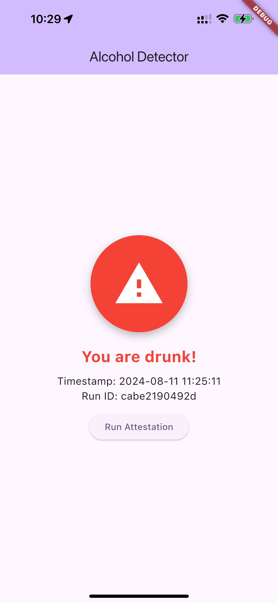
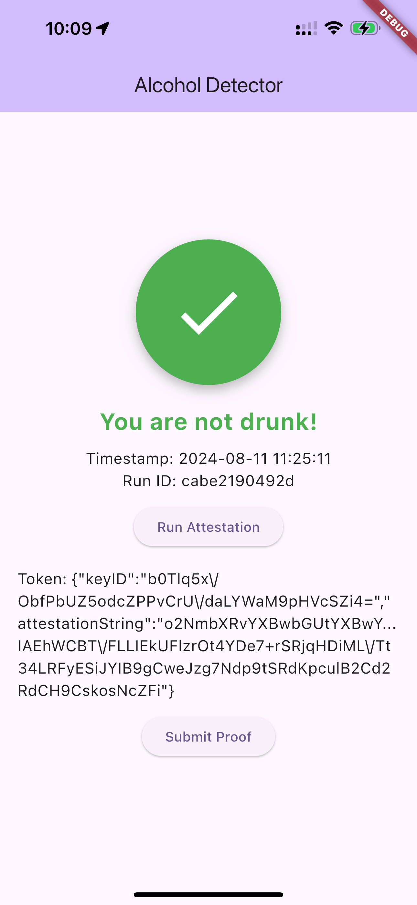
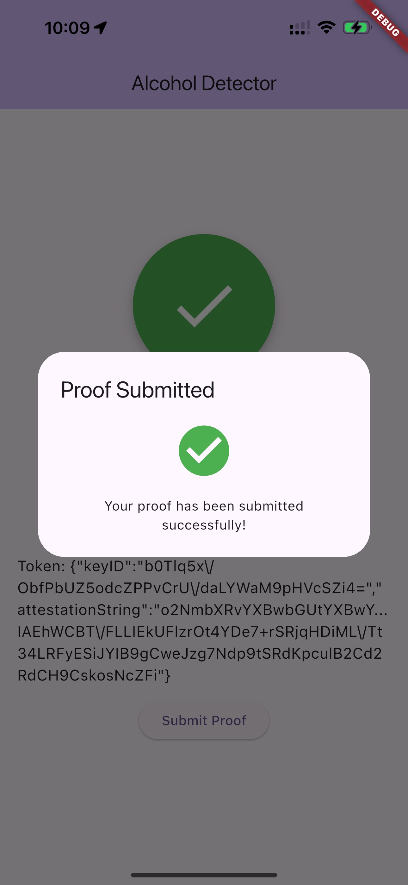
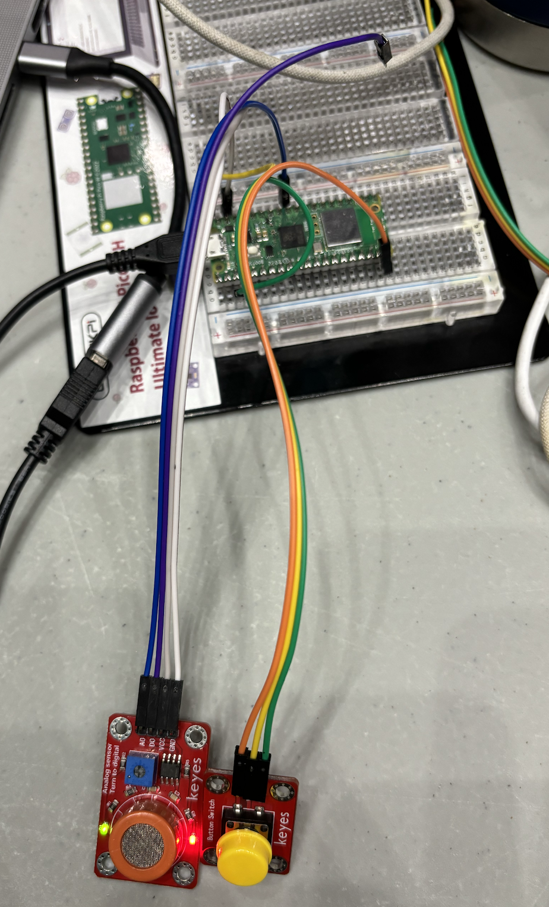
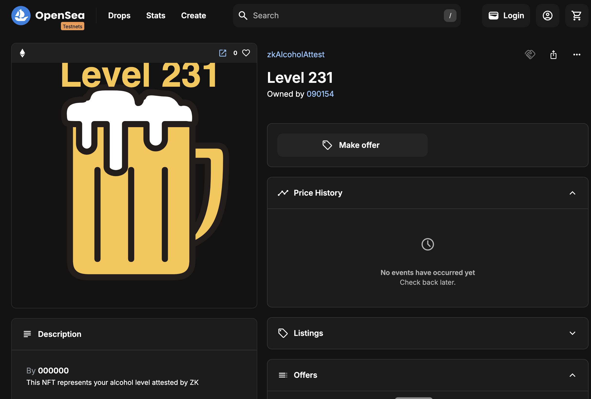

# drinKZ: Proving breathalyzer test results

drinKZ is meant to bring ownership to one's data, specifically with alcohol consumption measurement.

<div style="display: flex; justify-content: space-between;">
  
  
  
  
</div>

## Key Features

- Trusted Data Collection: Utilizes Raspberry Pi devices to collect breathalyzer data, which is then securely processed by an iPhone app.
- Hardware Attestation & zkVM: Apple's App Attest and zkVM ensures that data comes from a specific device and untampered with.
- Blockchain: Mints NFTs on-chain representing verified alcohol levels, providing a tamper-proof record of test results.

## Use Cases

- DUI Defense: Provides verifiable evidence for individuals falsely accused of drinking and driving.
- Privacy-Preserving Records: Allows users to maintain control over their data, choosing when and with whom to share their test results.
- Trusted IoT Data: Demonstrates a solution to the oracle problem for real-world sensing data in blockchain applications.

## Technical Stack


- Raspberry Pi
- iOS & App Attest
- Risc Zero zkVM
- Ethereum-compatible blockchain
- Proof verification stacks like Aligned

drinKZ represents a collaborative effort to solve the problem of data ownership and trust in IoT devices. It combines a product-driven approach to a real-world issue with a cutting-edge technical architecture, showcasing the potential of blockchain technology and zero-knowledge proofs in creating trustworthy systems for sensitive personal data.

## Build zkEVM and Contract

```bash
cd zk_attest
cargo build
cd ../contract
forge build
```

## Build and Run App

```bash
cd app
flutter run ios --debug -t lib/main.dart
```

## Deployment

```bash
cd contract
forge script script/Deploy.s.sol --rpc-url "https://eth-sepolia.g.alchemy.com/v2/${ALCHEMY_API_KEY}" --broadcast
forge verify-contract --constructor-args 0x000000000000000000000000925d8331ddc0a1F0d96E68CF073DFE1d92b69187 --chain-id 11155111 0x0bAd2B70c89a5fe1EC6C546C22831Cc7ca22bfe1 contracts/ZkAlcoholAttest.sol:ZkAlcoholAttest
```

Deployed smart contract address: on [Sepolia](https://sepolia.etherscan.io/address/0x0bad2b70c89a5fe1ec6c546c22831cc7ca22bfe1)

Example NFT: [zkAlcoholAttest](https://testnets.opensea.io/assets/sepolia/0x0bad2b70c89a5fe1ec6c546c22831cc7ca22bfe1/0)



## Submit Proof

1. Submit proof to Sepolia and mint an NFT:

    ```bash
    cargo run --bin publisher -- \
        --chain-id=11155111 \
        --rpc-url="https://eth-sepolia.g.alchemy.com/v2/${ALCHEMY_API_KEY}" \
        --contract=0x0bAd2B70c89a5fe1EC6C546C22831Cc7ca222bfe1
    ```

2. Submit proof to Aligned

    ```bash
    aligned deposit-to-batcher \
        --batcher_addr 0x815aeCA64a974297942D2Bbf034ABEe22a38A003 \
        --rpc https://ethereum-holesky-rpc.publicnode.com \
        --chain holesky \                      
        --keystore_path ~/.foundry/keystores/test \
        --amount 0.1ether

    aligned submit \            
        --proving_system Risc0 \
        --keystore_path ~/.foundry/keystores/test \
        --conn wss://batcher.alignedlayer.com \
        --proof risc_zero_zk_attest.proof \
        --vm_program zk_attest_id.bin \
        --public_input risc_zero_zk_attest.pub \                       
        --proof_generator_addr 0x66f9664f97F2b50F62D13eA064982f936dE76657 \    
        --rpc 'https://ethereum-holesky-rpc.publicnode.com'
        --batcher_addr '0x815aeCA64a974297942D2Bbf034ABEe22a38A003'
    ```

Submitted batch: [Aligned Explorer](https://explorer.alignedlayer.com/batches/0x644f6ebee7781ca708cf391709b14b54b4e07eb2204bf072cddb58dd5363a8b8)
